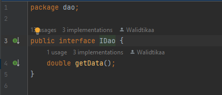
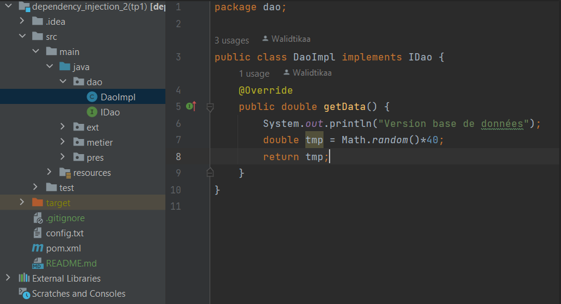
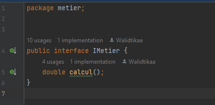
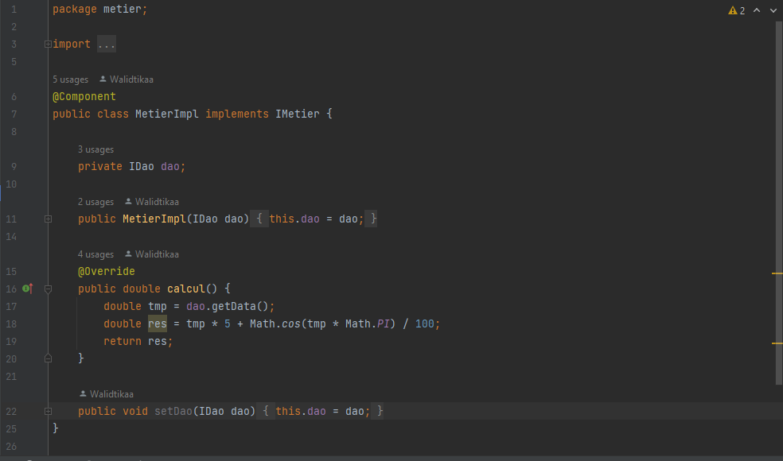
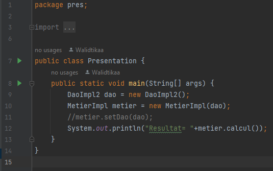
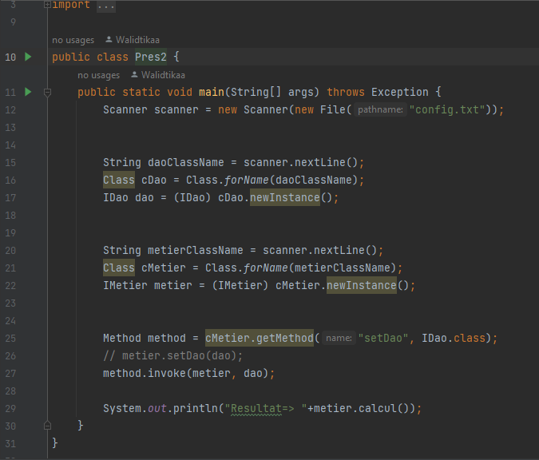
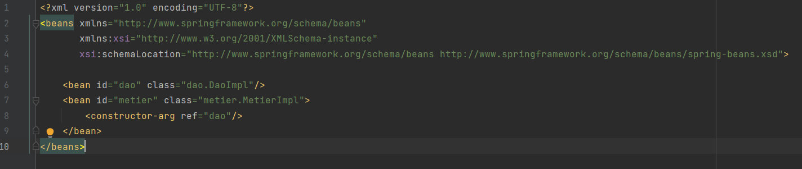
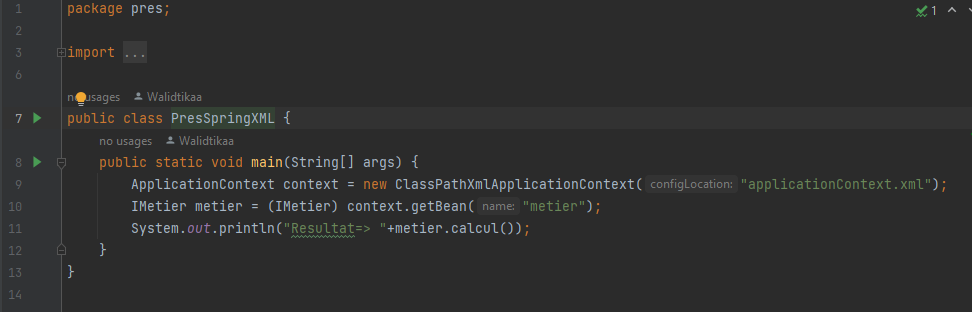
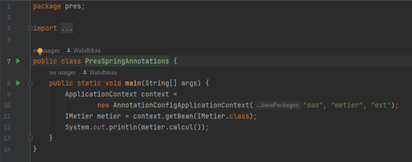

<h1>Dependency Injection</h1>

<h3>1 - Création de l'interface IDao avec la méthode getDate</h3>

<h3>2 - Création d'une implémentation de l'interface IDao</h3>

<h3>3 - Création de l'interface IMetier avec la méthode calcul</h3>

<h3>4 - Création d'une implémentation de l'interface IMetier avec le couplage faible</h3>

<h3>5 - Injection des dépendances par instanciation statique</h3>

<h3>6 - Injection des dépendances par instanciation dynamique</h3>

<h3>7 - Injection des dépendances En utilisant le Framework Spring version XML</h3>

<h3>8 - Injection des dépendances En utilisant le Framework Spring version Annotations</h3>

